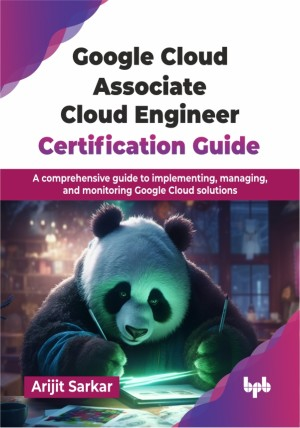

# Google Cloud Associate Cloud Engineer Certification Guide

A comprehensive guide to implementing, managing, and monitoring Google Cloud solutions.

This is the repository for [Google Cloud Associate Cloud Engineer Certification Guide
](https://bpbonline.com/products/google-cloud-associate-cloud-engineer-certification-guide?variant=44639070421192),published by BPB Publications.

## About the Book
With the emergence of cloud computing, organizations are moving their workloads to the public cloud to reduce the capital expenditure towards on-premises IT infrastructure. Google Cloud Platform is one of the major public cloud platforms. Hence, learning about it in depth is crucial for anyone aiming to excel in the cloud computing landscape. 

This book systematically explores GCP, starting with cloud fundamentals and an overview of GCP services, followed by the ACE exam scope. You will gain practical skills in the console, Cloud Shell, billing, APIs, and IAM, and explore storage (GCS) and databases (Cloud SQL, Spanner). You will master compute through VMs, Cloud Run, GKE, App Engine, Cloud Functions, learn networking with VPC, firewall rules, load balancing, DNS, CDN, and NAT, and discover big data, AI/ML, deployment, and monitoring. You will understand the application lifecycle and ACE exam specifics with practice simulations.

By the end of this book, you will be well-prepared to confidently tackle the Associate Cloud Engineer certification exam and equipped with the practical knowledge to effectively design, deploy, and manage solutions on GCP, ready to contribute meaningfully to cloud-driven projects.

## What You Will Learn
• Understand cloud computing in enterprise environment.

• Google Cloud Platform Compute Platforms / Services.

• Different database options in Google Cloud Platform for various use cases.

• End-to-end use case implementation in Google Cloud Platform.

• Detailed explanation on networking in cloud computing.

• Confidently apply GCP knowledge for ACE certification and cloud roles.
